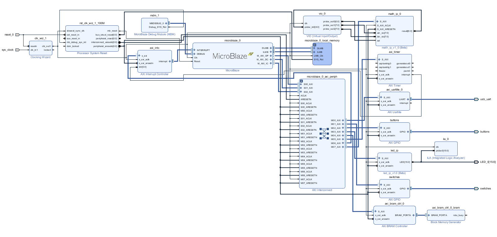
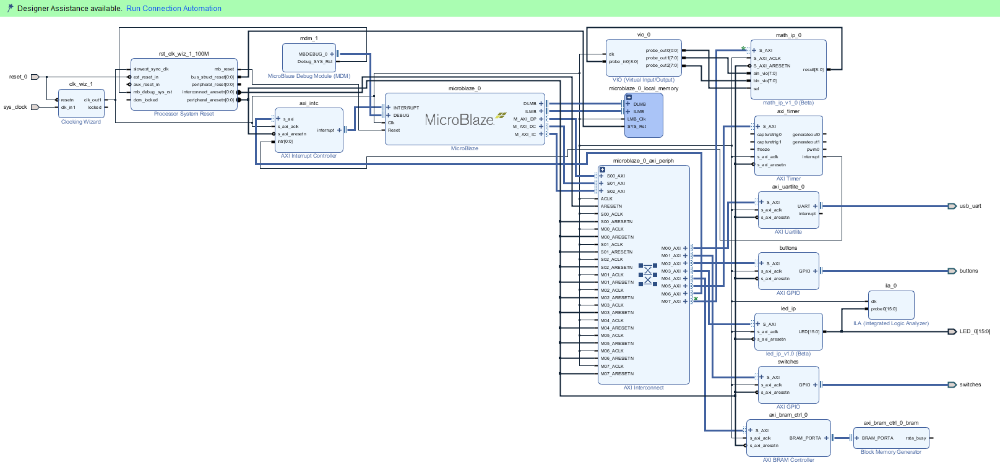
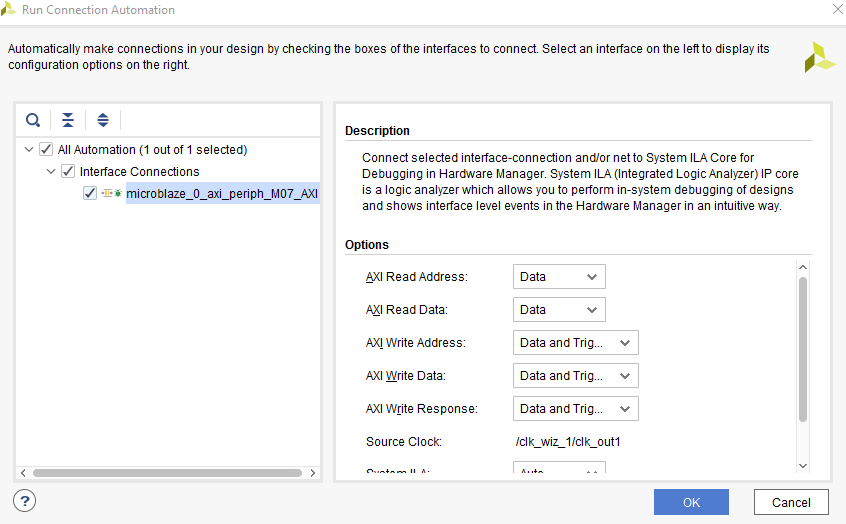
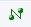
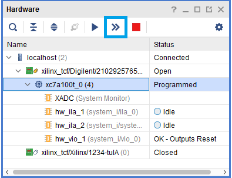
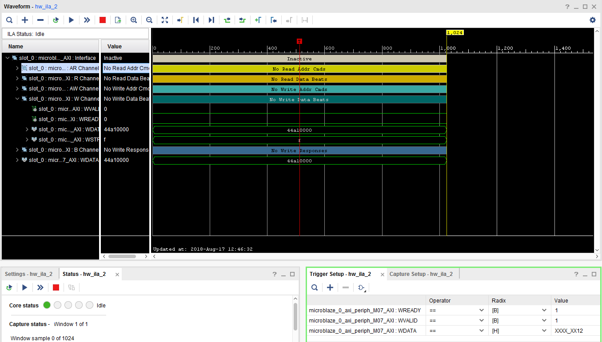
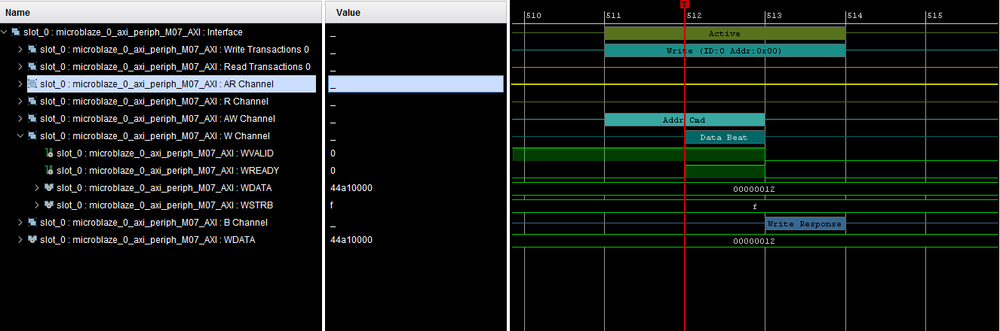
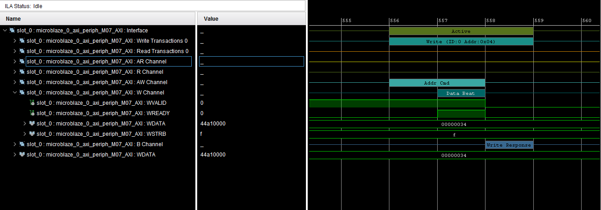
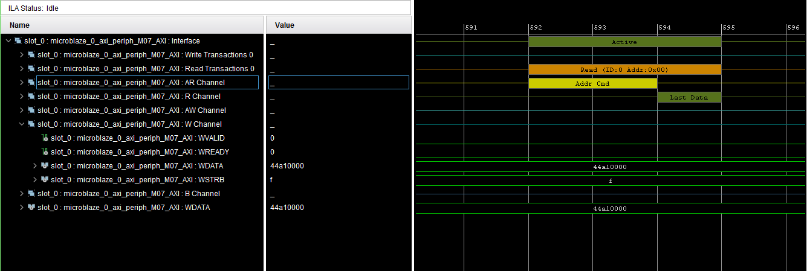
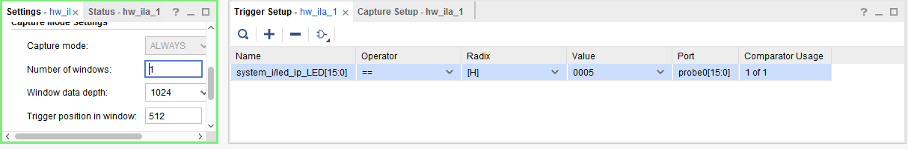

# Debugging Using Hardware Analyzer

## Objectives
After completing this lab, you will be able to:

* Add a VIO core in the design
* Use a VIO core to inject stimulus to the design and monitor the response
* Mark nets as debug so AXI transactions can be monitored
* Add an ILA core in Vivado
* Perform hardware debugging using the hardware analyzer
* Perform software debugging using the SDK

## Steps

### Open the Project

1.  Start Vivado if necessary and open either the lab5 project (lab5.xpr) you created in the previous lab or the lab5 project in the {labsolutions} directory using the **Open Project** link in the Getting Started page.
1.  Select **File > Project > Save As …** to open the Save Project As dialog box. Enter lab6 as the project name.  Make sure that the Create Project Subdirectory option is checked, the project directory path is {labs} and click **OK.**
    This will create the lab6 directory and save the project and associated directory with lab6 name
1. Click **Settings** in the _Flow Navigator_ pane.
1. Expand **IP** in the left pane of the _Project Settings_ form and select **Repository.**
1. Click on the _plus_ button of the IP Repositories panel, browse to **{sources}\lab2\math_ip** and click **Select.**
    The directory will be scanned and one IP will be detected and reported.   

    <p align="center">
    
    </p>
    <p align = "center">
    <i>Change AXI GPIO default name</i>
    </p>
1. Click **OK** twice to close the window.

### Add the Custom IP

1. Click **Open Block Design** in the _Flow Navigator_ pane to open the block diagram.

1. Click the  button and search for **math** in the catalog.
1. Double-click the **math\_ip\_v1\_0** to add an instance of the core to the design.
1. Click on **Run Connection Automation**, ensure S\_AXI in math\_ip\_0 is selected, and click **OK.**

    The _Math IP_ consists of a hierarchical design with the lower-level module performing the addition. The higher-level module includes the two slave registers.
    <p align="center">
    
    </p>
    <p align = "center">
    <i>Custom Core's Main Functional Block</i>
    </p>
## Add the ILA and VIO Cores        

We want to connect the ILA core to the LED interface.  Vivado prohibits connecting ILA cores to interfaces.  In order to monitor the LED output signals, we need to convert the LED interface to simple output port.


### Add the ILA core and connect it to the LED output port.
1. Click the  button and search for **ila** in the catalog.
1. Double-click on the **ILA (Integrated Logic Analyzer)** to add an instance of it.  The _ila\_0_ instance will be added.
1. Double-click on the _ila\_0_ instance.

1. Select **Native** as the _Monitor type_.

1. Select the **Probe Ports** tab, and set the **Probe Width** of _PROBE0_ to **16** and click **OK**.
1. Using the drawing tool, connect the **PROBE0** port of the _ila\_0_ instance to the **LED[15:0]** port of the _led\_ip_ instance.
1. Connect the **clk** port of the _ila\_0_ instance to the **Clk** port of the Microblaze subsystem.

### Add the VIO core and connect it to the math\_ip ports.

1. Click the  button and search for **vio** in the catalog.

1. Double-click on the **VIO (Virtual Input/Output)** to add an instance of it.
1. Double-click on the _vio\_instance_ to open the configuration form.
1. In the _General Options_ tab, leave the _Input Probe Count_ set to **1** and set the _Output Probe Count_ to **3**
1. Select the _PROBE\_IN Ports_ tab and set the _PROBE\_IN0_ width to **9**.
1. Select the _PROBE\_OUT Ports_ tab and set _PROBE\_OUT0_ width to **1** , _PROBE\_OUT1_ width to **8** , and _PROBE\_OUT2_ width to **8**.
1. Click **OK**.
1. Connect the VIO ports to the math instance ports as follows:
   ```
    PROBE_IN -> result
    PROBE_OUT0 -> sel
    PROBE_OUT1 -> ain_vio
    PROBE_OUT2 -> bin_vio
   ```
1. Connect the **clk** port of the _vio\_0_ to Clk net.
1. The block diagram should look similar to shown below.
    <p align="center">
    
    </p>
    <p align = "center">
    <i>VIO added and connections made</i>
    </p>

### Mark Debug the S\_AXI connection between the AXI Interconnect and math\_0 instance

1. Select the **S\_AXI** connection between the AXI Interconnect and the _math\_ip\_0_ instance .

1. Right-click and select **Debug** to monitor the AXI4Lite transactions.

    The block diagram should look as shown below.
    <p align="center">
    
    </p>
    <p align = "center">
    <i>Block diagram of the design after marking AXI connection to the math_ip_0 instance for debugging</i>
    </p>
1. Click the **Run Connection Automation** link to see the form where you can select the desired channels to monitor.
1. Change _AXI Read Address_ and _AXI Read Data_ channels to **Data** since we will not trigger any signals of those channels.

    This saves resources being used by the design.
    <p align="center">
    
    </p>
    <p align = "center">
    <i>Selecting channels for debugging</i>
    </p>
1. Select the _Diagram_ tab, and click on the  (Validate Design) button to make sure that there are no errors.
1. Verify that there are no unmapped addresses shown in the _Address Editor_ tab.

### Add Design Constraints and Generate Bitstream        

1. Right click in the _Sources_ panel, and select **Add Sources.**
1. Select _Add or Create Constraints_ and click **Next**.
1. Click the _Plus_ button then **Add Files**, browse to **{sources}\lab6\** and select **Nexys-4-DDR.xdc** or **lab2\_pynqz2.xdc** depending on the board you are using.
1. Click **OK** and then click **Finish.**
1. Click on the **Generate Bitstream** to run the implementation and bit generation processes.
1. Click **Save** to save the project (if prompted), **OK** to ignore the warning (if prompted), and **Yes** to launch Implementation (if prompted). Click **OK** to launch the runs.

1. When the bitstream generation process has completed successfully, click **Cancel**.

### Generate an Application in SDK        

1. Export the hardware configuration by clicking **File &gt; Export &gt; Export Hardware…** , click the box to _Include Bitstream_
1. Click **OK** to export and **Yes** to overwrite the previous project created by lab5.
1. Launch SDK by clicking **File &gt; Launch SDK** and click **OK.**
1. Right-click on the **lab5** and **lab5\_bsp** and **system\_wrapper\_hw\_platfrom\_0** projects in the Project Explorer view and select **Close project**.


1. Select **File &gt; New** &gt; **Application Project.**
1. In the _Project Name_ field, enter **lab6** as the project name, leave all other settings to their default&#39;s and click **Next** (a new BSP will be created) .
1. Select the **Empty Application** template and click **Finish.**

    The lab6 project will be created in the Project Explorer window of the SDK.

1. Select **lab6 &gt; src** in the project view, right-click, and select **Import.**
1. Expand the **General** category and double-click on **File System.**
1. Browse to the **{sources}\lab2** folder.
1. Select **lab6.c** and click **Finish.**

    A snippet of the part of the source code is shown in the following figure. It shows that two operands are written to the custom core, the result is read, and printed out.  The write transaction will be used as a trigger condition in the Vivado Logic Analyzer.
    <p align="center">
    
    </p>
    <p align = "center">
    <i>Source Code snippet</i>
    </p>

### Test in Hardware        

1. Connect and power up the board.
1. Select **Xilinx** &gt; **Program FPGA**.
1. Select _C:\xup\embedded\2018_2_microblz\lab6\lab6.sdk\lab6\Debug\lab6.elf_ in **ELF/MEM File to Initialize BRAM** and click **Program**

1. Select the **lab6** project in _Project Explorer_, right-click and select **Debug As &gt; Launch on Hardware** (System Debugger) to download the application, execute ps7\_init. (If prompted, click **Yes** to switch to the Debug perspective.)  The program execution starts and suspends at the entry point.
1. Select **Window &gt; Show view &gt; Terminal** tab.  
1. Click on   and select the appropriate COM port (depending on your computer), and configure it as you did it in Lab 1.

### Start the hardware session from Vivado.
1. Switch to Vivado.
1. Click on **Open Hardware Manager** from the _Program and Debug_ group of the _Flow Navigator_ pane to invoke the analyzer.
1. Click on the **Open Target &gt; Auto connect** to establish the connection with the board.
1. Select **Window &gt; Debug Probes**

    The hardware session will open showing the **Debug Probes** tab in the **Console** view.
    <!--  <p align="center">
    
    </p>
    <p align = "center">
    <i>Debug probes</i>
    </p> -->
    The hardware session status window also opens showing that the FPGA is programmed (we did it in SDK), there are three cores out of which the two ila cores are in the idle state.
    <p align="center">
    
    </p>
    <p align = "center">
    <i>Hardware session status</i>
    </p>
1. Select the XC7Z100, and click on the **Run Trigger Immediate** button to see the signals in the waveform window.
    <p align="center">
    
    </p>
    <p align = "center">
    <i>Opening the waveform window</i>
    </p>
### Setting up hw\_ila\_2 and using it

1. Click on the _hw\_ila\_2_ tab to select it. In the **Debug Probes** window, under _hw\_ila\_2_, drag and drop the **WDATA** signal to the _ILA Basic Trigger setup_ window **.**
1. Set the value to **XXXX\_XX12** (HEX) (the value written to the math\_0 instance at line 24 of the program).
1. Similarly, add **WREADY,**** WSTRB, **and** WVALID** signals to the _ILA Basic Trigger setup_ window.
1. Change the value of **WVALID** and **WREADY** to 1.
1. Set the trigger position of the _hw\_ila\_2_ to **512** in the _Settings – hw\_ila\_2_
    <p align="center">
    
    </p>
    <p align = "center">
    <i>Setting up the ILA</i>
    </p>
1. Similarly, set the trigger position in the _Settings __–__ hw\_ila\_1_ tab to **512**.
1. Select **hw\_ila\_2** in the _Hardware_ window and click on the **Run Trigger** button ()and observe that the _hw\_ila\_2_ core is armed and showing the status as **Waiting For Trigger**.
    <p align="center">
    
    </p>
    <p align = "center">
    <i>Hardware analyzer running and in capture mode</i>
    </p>
1. Switch to SDK.
1. Near line 27 (right click in the margin and select _Show Line Numbers_ if necessary_),_ double click on the left border on the line where xil\_printf statement is (before the while (1) statement) is defined in the lab2.c window to set a breakpoint.

    <p align="center">
    
    </p>
    <p align = "center">
    <i>Setting a breakpoint</i>
    </p>
1. Click on the **Resume** () button to execute the program and stop at the breakpoint.

1. In the Vivado program, notice that the **hw\_ila\_2** status changed from _Waiting for Trigger_ to _Idle_, and the waveform window shows the triggered output (select the _hw\_ila\_data\_2.wcfg_ tab if necessary).
1. Move the cursor to closer to the trigger point and then click on the  button to zoom at the cursor. Click on the **Zoom In** button couple of times to see the activity near the trigger point. Similarly, you can see other activities by scrolling to right as needed.
    Around the 512<sup>th</sup> sample WDATA being written is 0x012 at offset 0 (AWADDR=0x0).
    <p align="center">
    
    </p>
    <p align = "center">
    <i>Zoomed waveform view of the three AXI transactions</i>
    </p>
    At the 556<sup>th</sup> sample, offset is 0x4 (AWADDR), and the data being written is 0x034.
    <p align="center">
    
    </p>
    <p align = "center">
    <i>Zoomed waveform view of the three AXI transactions</i>
    </p>

    At the 592<sup>th</sup> sample, data is being read from the IP at the offset 0x0 (ARADDR)
    <p align="center">
    
    </p>
    <p align = "center">
    <i>Zoomed waveform view of the three AXI transactions</i>
    </p>    
1. Click on the **Resume** () button to execute the program completely.

### Using the VIO core

1. In Vivado, double click on **hw\_vio\_1** core in the _Hardware_ panel.
1. Click on the  button and select all signals to stimulate and monitoring. Click **OK**.

1.  Change the **vio\_0\_probe\_out0** value to **1** so the math\_ip core input can be controlled via the VIO core.
    <p align="center">
    
    </p>
    <p align = "center">
    <i>VIO probes</i>
    </p>
1. Change **vio\_0\_probe\_out1** value to **55** (in Hex), and similarly, **vio\_0\_probe\_out2** value to **44** (in Hex). Notice that for a brief moment a blue-colored up-arrow will appear in the Activity column and the result value changes to **099** (in Hex).
    <p align="center">
    
    </p>
    <p align = "center">
    <i>Input stimuli through the VIO core's probes</i>
    </p>
1. Try a few other inputs and observe the outputs.
1. Once done, set the _vio\_0\_probe\_out0_ to **0** to isolate the vio interactions with the math\_ip core.

### Setting up hw\_ila\_1 and using it

1. Double click on **hw\_ila\_1** in the _Hardware_ panel.

1. Add the LEDs to the _Basic Trigger Setup_, and set the trigger condition of the _hw\_ila\_1_ to trigger at LED output value equal to **0005** for the PYNQ-Z1/PYNQ-Z2.
    <p align="center">
    
    </p>
    <p align = "center">
    <i>Setting up Trigger for hw_ila_1</i>
    </p>
1. Ensure that the trigger position for the _hw\_ila\_1_ is set to **512**.

   Make sure that the last two bits of the switches are not set high as this is the exit pattern.

1. Right-click on the _hw\_ila\_1_ in the _Hardware_ window, and arm the trigger by selecting **Run Trigger.**

    The hardware analyzer should be waiting for the trigger condition to occur.

1. In the SDK window, click on the _Resume_ button.

1. Press the push-buttons and see the corresponding LED turning ON and OFF.
1. When the condition is met, the waveform will be displayed.
    <p align="center">
    
    </p>
    <p align = "center">
    <i>ILA waveform window after Trigger</i>
    </p>

## Conclusion

   In this lab, you added a custom core with extra ports so you can debug the design using the VIO core. You instantiated the ILA and the VIO cores into the design. You used Mark Debug feature of Vivado to debug the AXI transactions on the custom peripheral. You then opened the hardware session from Vivado, setup various cores, and verified the design and core functionality using SDK and the hardware analyzer.

.
